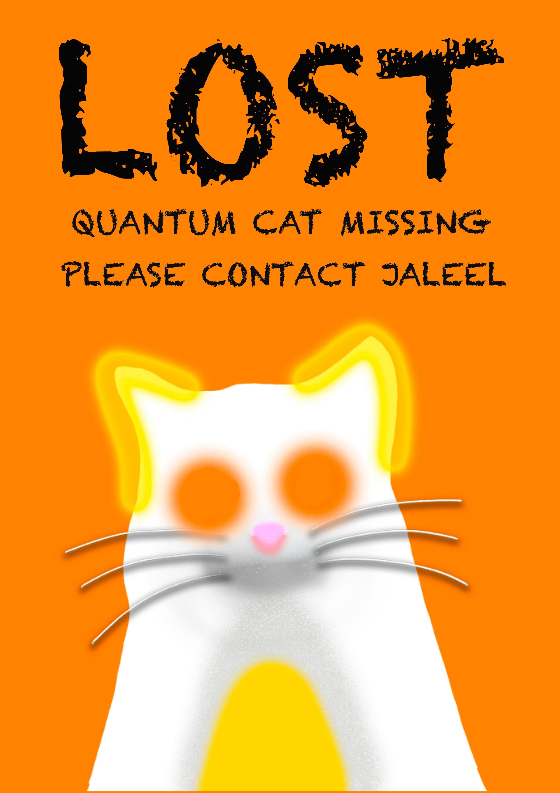
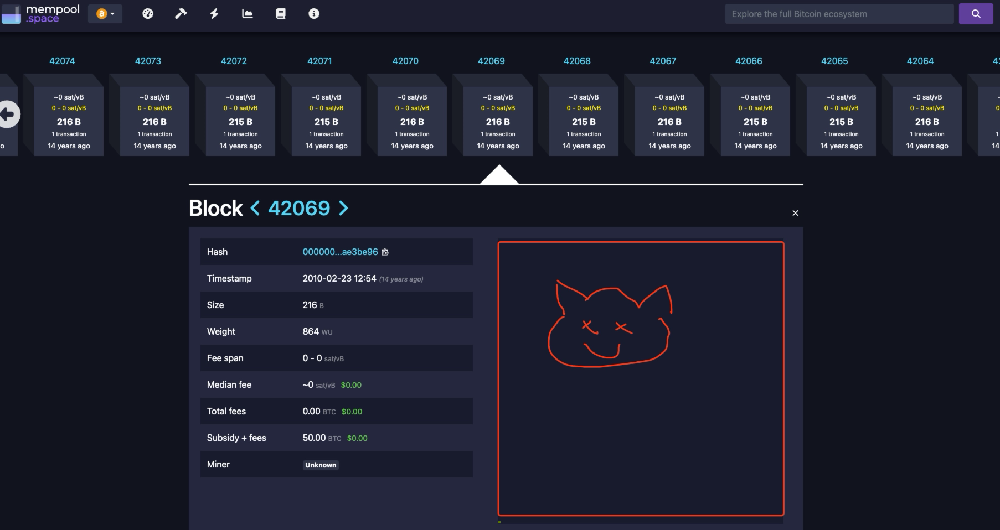

# 量子猫视频需求

人物：主人公一个，路人随便

经过：主人公**焦急**地拿着**寻猫启事**，在路上，在草丛，在树上，在家的角落里（**任意的地方可以，就是要重点突出一个四处都没有找到**），都没找到。

中间会遇到一个路人，然后给路人看**寻猫启事，问他有没有看到过这只猫呀****。路人说没有诶，然后就过了。**

> 1. 你要拿着寻猫启事
> 2. 第一步先对着摄像头，指着寻猫启事说，你有看到我的 op 猫猫吗
> 3. 然后中间的步骤你做的都很好，就是要喊 op 猫猫，不是喊你的猫的名字
> 4. 之后的都没有问题，然后最后结尾的时候，你问过路人之后，路人说没看到过。你最后要表现出绝望，可以很假装的哭 😭，就是用手抹眼睛，说呜呜呜，我的 op 猫呢

online 部分：

这个主人公（加六）一直找不到 op 猫，然后发到了我们三个人的群里。

然后另外一个人（迷迭）看到了之后，就问它啥是 op-cat，然后就可以在聊天框里，开始普及。（我们要提前写好要发在聊天框里用来普及的脚本）

> 微信群里的对话：
> **Jaleel：求助！各位！你们能帮我找到我的猫吗？她叫 OP_CAT，我不知道她去哪儿了……**
> **拖鱼**：OP_CAT？抱歉我没听说过诶
> **Arentu**：我最近倒是听说在比特币网络上有个 OP_CAT，好像挺火的样子。
> **拖鱼：啥？**比特币网络上有个 OP_CAT？你能解释一下吗？
> **Jaleel：你是说我的猫上链了？**
> **Arentu**：哈哈，OP_CAT 其实是个比特币的操作码。你可以简单理解为，你有两块拼图，OP_CAT 就是帮你把它们拼在一起的工具。比如，一个拼图写着“早安”，另一个写着“上海”，用 OP_CAT 就能拼成“早安上海”。
> **拖鱼：**哦哦，听起来像个黏合剂。这对比特币来说很重要吗？
> **Arentu：**我觉得不仅仅是个黏合剂。它其实能让比特币做更多的高级操作，就像打开了一个秘密花园的大门。不过，在 2010 年的时候因为一些技术问题被暂时移除了。
> **拖鱼：**对对，但要小心哦，这种强大的工具如果用不好，可能会带来安全问题。比特币的世界非常注重安全和稳定，所以大家对这种变化持谨慎态度。
> **Jaleel：有道理，就像是在讨论要不要在家里养只猫。有人觉得会带来欢乐，有人担心家里的家具被抓坏 😂**
> **拖鱼：**哈哈，这比喻妙！看起来你的猫很可能去比特币链上了
> **Jaleel：那怎么办，你能帮我去比特币上找一下 OP_CAT 吗？**
> **Arentu**：好呀，我去链上帮你找找看 OP_CAT，说不定真在那儿，毕竟比特币的世界总是充满各种有意思的事儿。

**英文版本：**

> **Jaleel**: Guys, I need help! Can anyone help me find my cat? Her name is OP_CAT, and I have no idea where she went...
> **Tuo Yu**: OP_CAT? Sorry, I haven't heard about that.
> **Arentu**: I've actually heard about an OP_CAT on the Bitcoin network recently. It's been quite a buzz.
> **Tuo Yu**: What? There's an OP_CAT on the Bitcoin network? Can you explain more?
> **Jaleel**: Are you saying my cat is on the blockchain?
> **Arentu**: lol, well, OP_CAT is actually a Bitcoin operation code. Think of it like this: you have two puzzle pieces, and OP_CAT is the tool that helps you put them together. For instance, one piece says "Good Morning" and the other says "Shanghai". With OP_CAT, you can combine them to say "Good Morning Shanghai".
> **Tuo Yu**: Oh, I see, it sounds like a glue. Is that important for Bitcoin?
> **Arentu**: It's more than just a glue. It actually enables Bitcoin to perform more advanced operations, kind of like opening the door to a secret garden. However, due to some technical issues, it was temporarily removed in 2010.
> **Tuo Yu**: Right, but we have to be careful, right? Such a powerful tool could lead to safety issues if not used properly. The Bitcoin world places a high emphasis on safety and stability, so everyone is quite cautious about these changes.
> **Jaleel**: Makes sense, it's like deciding whether to have a cat at home. Some people think it brings joy, others worry about the furniture getting scratched 😂
> **Tuo Yu**: lol, what a great analogy! Looks like your cat might have really gone onto the Bitcoin blockchain.
> **Jaleel**: So what now, can you help me find OP_CAT on the Bitcoin network?
> **Arentu**: Sure thing, I'll take a look on the blockchain for your OP_CAT. Who knows, it might actually be there. After all, the world of Bitcoin is always full of surprises.

然后另外一个人（拖于）说 maybe 我可以帮你在区块链里找一找，然后我就打开 mempool，一直滑动区块，直到滑到第 42069 个块，突然蹦出来一只上面的 opcat（这里又回到现实视角，我可以让我室友从第三视角帮我拍浏览区块的样子）

最后我们自己拍一个结尾，我假装无聊地点开 mempool，在那里滑动区块，突然从区块里跳出来了一只 op 猫
